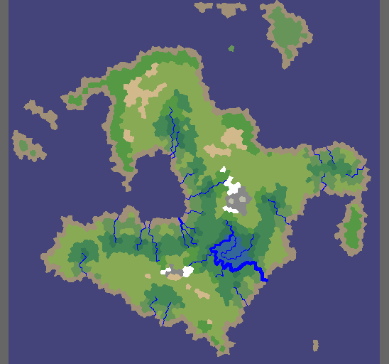

# Polygon Map Generation

Polygon Map generation based on this article: [Polygonal Map Generation for Games](http://www-cs-students.stanford.edu/~amitp/game-programming/polygon-map-generation/#elevation)  
Also used this library for the Voronoi generation: [csDelaunay](https://github.com/PouletFrit/csDelaunay)  
And this for some Editor Buttons: [NaughtyAttributes](https://github.com/dbrizov/NaughtyAttributes)  

I tried to adapt some algorithms so it's easier for me to understand, even if that meant sacrificing perfomance. That means that many parts of the code, while still very similar, may have signficant changes.
